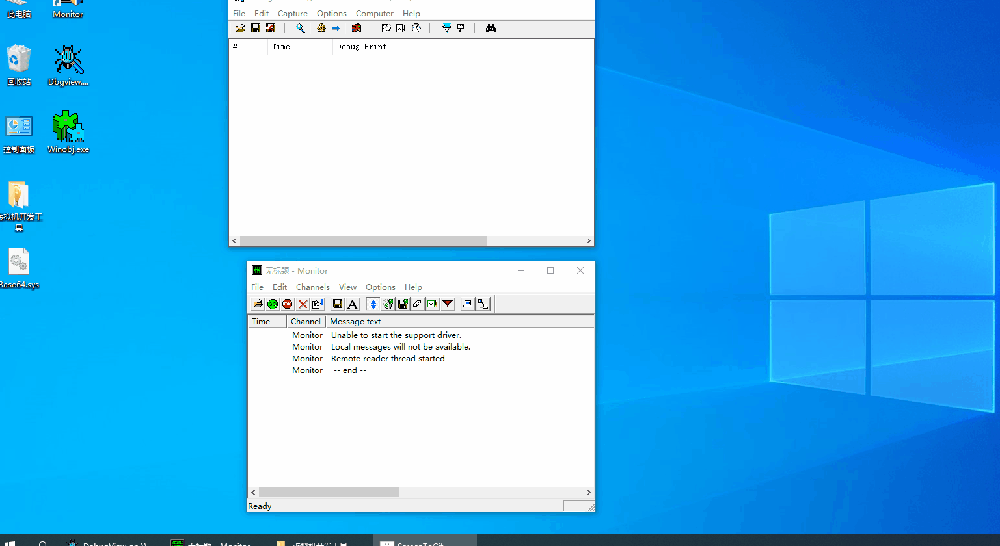

# Look at the pictures:  
<h1 align="center">
	
	 
	 
</h1>
   
# Win-Kernel-Crypto  
Windows kernel encryption library, support aes-256, rsa-2048 and higher, ecc-256, single file, minimal dependence, support R0 and R3  
For more paid encryption library, please contact xxxxxxxx (Temporarily not sell) 
# Windows内核加密  
windows内核加密库，支持Base64、AES-256、RSA-2048以及更高、ECC-256，单文件，依赖极小，同时支持R0和R3。  
更多付费加密库请联系 xxxxxxxx (暂不出售)
